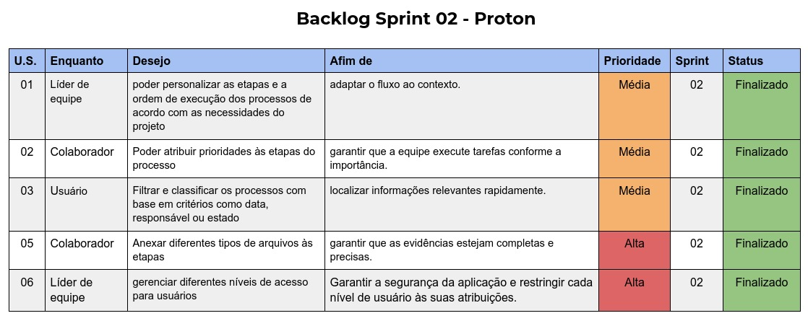

## :bookmark_tabs: Objetivo do Produto:

O objetivo do projeto é desenvolver uma plataforma web que auxilie na organização e documentação dos processos que são desenvolvidos em uma empresa de tecnologia voltada à saúde.
<br>

:pushpin: Status do Projeto: Em andamento.

## :desktop_computer: Protótipo:

O protótipo da plataforma foi feito com o auxílio da ferramenta "Figma" e pode ser conferido interativamente através do link:
https://www.figma.com/file/MqZujqscYKOsjmD4UmxLQW/A.P.I.-Ionic-Health?type=design&node-id=1-3&mode=design
<br>

## 🛠️ Tecnologias e ferramentas utilizadas:

-   HTML: Estrutura das páginas.
-   CSS: Estilização.
-   React e Typescript: Manipulação de input.
-   Pyhton/Flask: Backend do produto.
-   Bootstrap: Estilização.
-   Figma: Prototipagem.
-   GitHub: Controle de versionamento, documentação e colaboração.
-   MySQL: Banco de Dados utilizado.

<div style-"display=inline_block">


</div> <br>

## Estrutura geral do projeto:

```
 📁 Proton
   |
   |-  📁 src
   |    |- 📁 control
   |    |- 📁 pages
   |    |- 📁 routes
   |    |- 📁 shared
   |        |- 📁 charts
   |        |- 📁 components
   |        |- 📁 contexts
   |        |- 📁 environment
   |        |- 📁 hooks
   |        |- 📁 layouts
   |        |- 📁 services
   |        |- 📁 themes
 📁 Docs
 📁 Server


```
<br>
## :dart: Backlogs & User Stories

### User Stories:


### Proton - Project Tracker, Organizer and Notifier
]
<br>
### 🏁 Entregas de Sprints
Cada entrega foi realizada a partir do desenvolvimento priorizado seguindo o backlog. 


| 01 | 04/09/2023 - 24/09/2023 | ✔️ Concluída    | ### Link - apresentação da 1ª Sprint: https://www.youtube.com/watch?v=w77srMqJYTw |
| 02 | 25/09/2023 - 15/10/2023 | ✔️ Concluída    |  |
| 03 | 16/10/2023 - 05/11/2023 | ✔️ Concluída    |  |
| 04 | 06/11/2023 - 26/11/2023 | - Não iniciada   |  |

### Link - apresentação da 1ª Sprint

https://www.youtube.com/watch?v=w77srMqJYTw

## Planejamento de entregas



<br>
#### :busts_in_silhouette: Apresentação da Equipe:

Somos uma equipe de jovens programadores interessados em criar soluções simples para problemas complexos e em aprender o máximo possível no processo.
Nosso foco é em identificar o objetivo principal de um produto para desenvolver soluções de maneira gradual e modular em torno deste objetivo, de forma que cada passo possa ser validado pelo(a) cliente e/ou usuários e o produto evolua organicamente.


| Função        | Nome                             | LinkedIn & GitHub                                                                                                                                                                                                                                                                                                           |
| ------------- | -------------------------------- | --------------------------------------------------------------------------------------------------------------------------------------------------------------------------------------------------------------------------------------------------------------------------------------------------------------------------- |
| Product Owner | Alícea P. de Lima Rocha          | [](https://www.linkedin.com/in/al%C3%ADcea-paula-de-lima-rocha-bab682157/) [](https://github.com/alicearocha)     |
| Scrum Master  | Amanda Mendes Caldeira           | [](https://www.linkedin.com/in/amanda-mendes-caldeira-b24389210/) [](https://github.com/AmendoaM)                 |
| Tech Lead     | Alexandre Jonas de Souza Fonseca | [](https://www.linkedin.com/in/alexandre-jonas-de-souza-fonseca-989920181/) [](https://github.com/AlexandreJonas) |
| Backend       | Alita Willians da Silva Amancio  | [](https://www.linkedin.com/in/alitaamancio/) [](https://github.com/AlitaAmancio)                                 |
| Frontend      | Joice Araújo                     | [](https://www.linkedin.com/in/joice-aparecida-581226250/) [](https://github.com/Joice-Araujo)                    |
| Backend       | Jonas Alves Bueno                | [](https://www.linkedin.com/in/jonas-alves) [](https://github.com/dodekafonos)                                    |
| BDA           | Vitor F. Morais                  | [](https://www.linkedin.com/in/vitor-faria-morais-330b19204/) [](https://github.com/vmorais111)                   |
